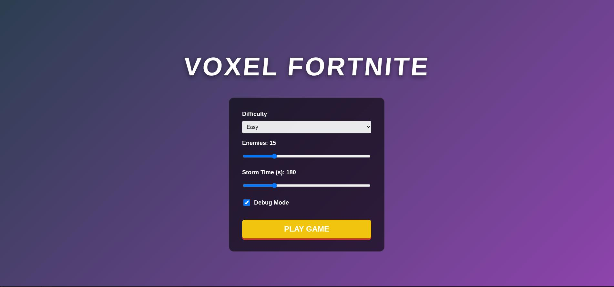
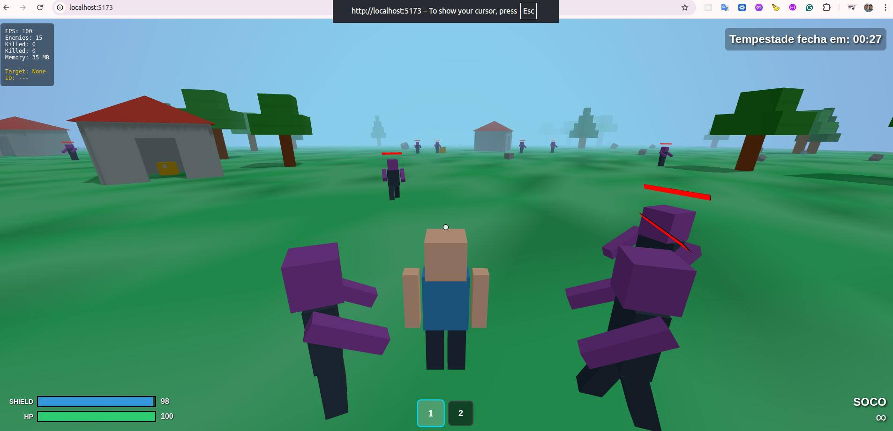
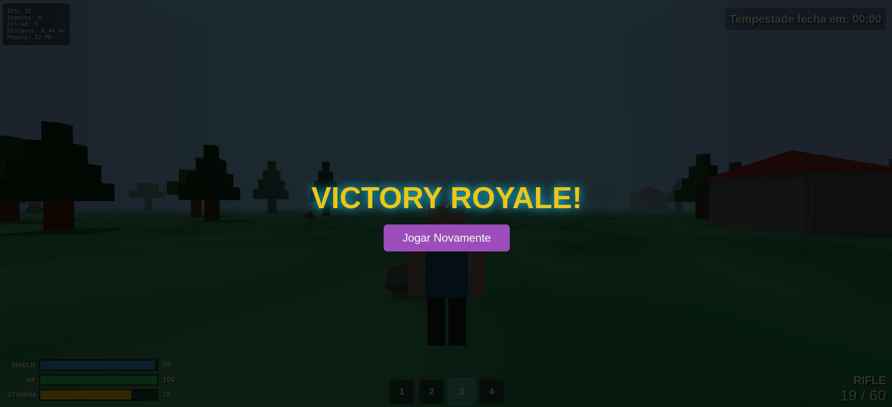

# Voxel Fortnite

A voxel-style battle royale game inspired by Fortnite, built with Three.js. Survive against AI enemies in a shrinking storm zone while managing your resources and exploring the procedurally generated world. Also includes Arena (fast skirmish), Matrix (sandbox without enemies) and Studio (build mode) variants.



## 🎮 Game Overview

Voxel Fortnite is a browser-based 3D survival game where you must eliminate all enemies before the storm closes in. The game features voxel-style graphics reminiscent of Minecraft, combined with battle royale mechanics similar to Fortnite.



## 🎯 Objective

**Primary Goal:** Eliminate all enemies on the map to achieve victory (Survival/Arena). Matrix is a chill mode without enemies; Studio lets you build freely.

**Secondary Goals:**
- Survive the shrinking storm zone
- Manage your stamina while exploring
- Collect weapons and resources from loot chests
- Maintain your health and shield

## 🕹️ Controls

### Movement
- **W/A/S/D** - Move forward/left/backward/right
- **Space** - Jump
- **Mouse** - Look around (camera control)
- **Click** - Lock pointer / Start game
- **V** - Toggle camera mode (First Person / Third Person)

### Combat
- **Left Click** - Shoot / Punch (if no ammo/weapon)
- **Right Click** - Aim (Sniper zoom)
- **R** - Reload weapon
- **1/2/3/4** - Switch weapons (hotbar)

### Interaction
- **E** - Interact with chests and objects
- **ESC** - Pause menu
- **`** (Backtick) - Toggle debug overlay

### Mobile Controls
- **Left Joystick** - Move
- **Right Screen Area** - Look/Aim
- **Buttons** - Fire, Jump, Sprint

## 🎲 Game Features

### Game Modes
- **Survival:** New hardcore mode with no storm, no vehicles, minimum map size of 100m. Features special zombie variants and sky loot rewards.
- **Arcade:** Classic loop with storm, loot, enemies, and all features enabled.
- **Arena:** Smaller map with dense cover for faster matches.
- **Matrix:** Sandbox with no enemies for exploration and testing.
- **Studio:** Creative mode with block building, scaling, move/remove tools and optional floating toggle.

### Combat System
- **6 Weapon Types:**
  - **Pistol:** 20 damage, 12/60 ammo, 0.5s cooldown
  - **Rifle:** 25 damage, 30/120 ammo, 0.15s cooldown
  - **Sniper:** 100 damage, 5/20 ammo, 2.0s cooldown with zoom
  - **SMG:** 15 damage, 40/200 ammo, 0.08s cooldown
  - **Shotgun:** 60 damage, 6/24 ammo, 1.0s cooldown
  - **DMR:** 45 damage, 12/48 ammo, 0.35s cooldown with mid-zoom
  - **Punch:** Always available fallback when unarmed or out of ammo

### Stamina System
- **Stamina Bar:** Depletes when punching rapidly or walking long distances
- **Fatigue Mechanic:** After 20 consecutive punches, you become tired for 3 seconds
- **Walking Drain:** Lose 0.5 stamina per 10 meters traveled
- **Recovery:** Stamina regenerates automatically over time

### Player Stats
- **Health (HP):** 100 points - your life force
- **Shield:** 100 points - absorbs damage before health
- **Stamina:** 100 points - used for punching and walking

### Enemy AI

#### Zombie Types
- **Normal Zombie (Purple):**
  - Standard enemy with base stats
  - Appears in all combat modes
  - Features glowing red eyes and jagged mouth with teeth
  
- **Fat Zombie (Green):**
  - 50% more health than normal zombies
  - 50% slower movement speed
  - Visibly larger and bulkier appearance with proportionally scaled facial features
  - Prominent belly and thicker limbs
  - Spawns in 1:1 ratio with normal zombies in Arcade and Survival modes
  
- **Big Zombie (Purple, 2x size):**
  - **Survival Mode Exclusive**
  - 5x health of normal zombies
  - 2x damage output
  - 25% slower movement
  - Larger attack range (3.5m vs 2m)
  - Spawns at 1 per 5 total enemies (e.g., 20 enemies = 4 Big Zombies)

- **Slenderman (Black suit, faceless):**
  - **Speed Demon / Glass Cannon**
  - 20% LESS health than normal zombies (fragile)
  - 50% FASTER movement speed
  - 50% MORE damage output
  - Extended attack range (3.0m)
  - Distinctive appearance: tall, thin, black suit with red tie, completely faceless
  - Long tentacle-like arms
  - Spawns at 1 per 10 total enemies in Arcade and Survival modes
  - High risk, high reward enemy type

#### Intelligent Behavior:
- Zombies detect and chase players within 25 meters
- Line-of-sight checking (won't chase through walls)
- Collision detection with environment objects
- Strafe movement to avoid being easy targets
- Melee attacks when in range
- Take storm damage when outside safe zone (Arcade mode)
- Proximity-based groaning sounds
  
#### Difficulty Levels:
- **Easy:** 50 HP, 2 damage, slower movement
- **Medium:** 100 HP, 5 damage, moderate speed
- **Hard:** 150 HP, 10 damage, fast and aggressive

*Note: Big Zombie, Fat Zombie, and Slenderman stats are multiplied on top of difficulty base stats*

### Storm Mechanics
- **Shrinking Zone:** The safe zone gradually shrinks over time
- **Storm Damage:** 1 HP per second when outside the safe zone
- **Affects Everyone:** Both players and enemies take storm damage
- **Configurable Timer:** Adjust storm duration in settings (default: 180 seconds)

### Loot System
- **Chests:** Scattered throughout the map, especially inside houses
- **Weapons:** Find better weapons to increase your firepower (including SMG/Shotgun/DMR)
- **Ammo:** Collect ammunition for your firearms
- **Juice Bottles:** Restore stamina
- **MedKits (First Aid Kits):** White case with red cross, heals 25% of max health (25 HP)
- **Backpacks:** Cosmetic pickups
- **Interactive:** Press **E** to open chests and collect items

#### Sky Loot System (Arcade & Survival)
A special reward system that activates when you've proven your combat skills:

**Activation Requirements:**
- All ground loot has been collected/opened
- Player has eliminated at least 30% of total zombies

**Rewards:**
- 2-3 random items drop from the sky near the player
- Drops occur every 45 seconds once activated
- Helps sustain long survival runs
- Console message confirms when system activates

### World Generation
- **Voxel Environment:** Minecraft-style blocky aesthetics
- **Procedural Elements:**
  - Large/small houses labeled as House/Mansion/Cabin plus plateaus, bunkers, ramps
  - Trees, rocks, bushes, grass clumps, vehicles, plateaus, small buildings
  - Arena layouts with crates and ramps
- **Mode-Specific Generation:**
  - **Survival:** Clean natural environment with only ground, trees, rocks, and bushes (no buildings or vehicles)
  - **Arcade:** Full environment with all structures and vehicles
  - **Arena:** Compact combat-focused layout
  
### HUD & Dashboard

**Status Bars (Bottom Left):**
- Shield bar (blue)
- Health bar (green)
- Stamina bar (gold)

**Timers (Top Center):**
- **Storm Timer:** Shows time until storm fully closes (Arcade mode only)
- **Survival Timer:** Tracks your survival time in MM:SS format (Arcade & Survival modes)

**Dashboard (Top Left):**
- **FPS:** Frames per second counter
- **Enemies:** Number of enemies alive
- **Killed:** Enemies eliminated
- **Distance:** Kilometers traveled
- **Memory:** RAM usage in MB
- **Target Inspect:** Shows name/ID/type of whatever your crosshair is on

**Weapon Info (Bottom Right):**
- Current weapon name
- Ammo count (current magazine / total ammo)

**Debug Mode (Optional):**
- Enable in settings or press **`** to see object IDs and names
- Per-object labels and extended target info

**Exploration Aids:**
- Minimap with player marker (toggleable)
- Storm timer indicator
- Touch controls for mobile (auto-enable or via settings)

## ⚙️ Settings & Customization

Access the settings menu from the main menu or pause screen:

### Game Settings
- **Difficulty:** Easy / Medium / Hard
  - Affects enemy health, damage, and speed
  
- **Enemy Count:** 5-500 enemies
  - Adjust the number of zombies on the map (Matrix/Studio spawn none)
  
- **Storm Time:** 60-1800 seconds
  - Configure how long before the storm fully closes
  
- **Camera Mode:** First Person / Third Person
  - Choose your preferred camera perspective
  - Can be toggled in-game with V key
  
- **Debug Mode:** On / Off
  - Toggle debug information overlay
- **Show Rendered IDs:** On / Off
- **Show Minimap:** On / Off
- **Touch Controls:** On / Off (mobile-friendly overlay)
- **Background Music:** On / Off and volume slider
- **Game Mode:** Survival/Arena/Matrix/Studio
  
### Settings Persistence
All settings are saved to browser localStorage and persist between sessions.

## 🎨 Visual Features

- **Voxel Art Style:** Blocky, Minecraft-inspired graphics
- **Dynamic Lighting:** Real-time shadows and ambient lighting
- **Camera Modes:**
  - **Third-Person (TPS):** Over-the-shoulder perspective with full character visibility
  - **First-Person (FPS):** Immersive eye-level view (toggle with V key)
- **Professional Crosshair:** Cross-style aiming reticle with shadow for visibility
- **Bullet Tracers:** Visual feedback showing shot trajectory
  - Yellow tracers for regular shots
  - Red tracers when hitting enemies
  - Fade-out animation for smooth visual effect
- **Character Animations:**
  - Walking/running animations
  - Punch animations (alternating arms)
  - Enemy movement and attack animations
  
- **Health Bars:** Floating health indicators above enemies
- **Damage Feedback:** Red flash effect when taking damage
- **Smooth Camera:** Follow player with smooth transitions

## 🏆 Victory & Defeat

### Victory Condition
Eliminate all enemies on the map to win the game. A victory screen will appear showing your achievement.



### Defeat Conditions
- **Health reaches 0:** You die and the game ends
- **Storm damage:** Staying outside the safe zone too long

### Game Over Screen
- Displays final statistics
- Option to restart the game
- Return to main menu

## 🛠️ Technical Details

### Built With
- **Three.js:** 3D graphics rendering
- **JavaScript (ES6+):** Game logic and mechanics
- **HTML5/CSS3:** UI and HUD elements
- **Vite:** Development server and build tool

### Performance
- **Target:** 60 FPS on modern browsers
- **Memory Optimized:** Efficient object pooling and cleanup
- **Browser Support:** Chrome, Firefox, Edge, Safari (latest versions)

### Debug Features
When debug mode is enabled:
- Object IDs and names displayed on screen
- Raycasting target information
- Enhanced dashboard statistics

## 🚀 Getting Started

### Prerequisites
- Modern web browser (Chrome, Firefox, Edge, Safari)
- Node.js and npm (for development)

### Installation

1. Clone the repository:
```bash
git clone https://github.com/felipemarques/threejs-voxel-fortnite.git
cd voxel-fortnite
```

2. Install dependencies:
```bash
npm install
```

3. Start the development server:
```bash
npm run dev
```

4. Open your browser and navigate to `http://localhost:5173`

### Building for Production

```bash
npm run build
```

The built files will be in the `dist/` directory.

## 🎮 Gameplay Tips

1. **Manage Your Stamina:** Don't spam punches - you'll get tired! Use firearms when possible.

2. **Watch the Storm:** Keep an eye on the storm timer and stay within the safe zone (Arcade mode).

3. **Explore Houses:** Loot chests inside buildings for better weapons and ammo.

4. **Use Cover:** Hide behind trees and rocks to avoid enemy attacks.

5. **Sniper Zoom:** Right-click with the sniper rifle to zoom in for precise shots.

6. **Reload Often:** Don't get caught with an empty magazine during a fight.

7. **Track Distance:** Monitor your distance traveled to manage stamina drain.

8. **Camera Perspective:** Use V to toggle between first and third person based on your preference.

9. **Watch Your Tracers:** Yellow bullet trails help you see where you're shooting and adjust your aim.

10. **Difficulty Matters:** Start on Easy to learn the mechanics, then increase difficulty.

11. **Survival Mode Strategy:**
    - No storm means you can take your time exploring
    - Focus on eliminating 30% of zombies to unlock sky loot
    - Collect all ground loot before the 30% threshold for maximum benefit
    - Big Zombies are tough - save your best weapons for them
    
12. **Zombie Variant Tactics:**
    - **Fat Zombies (Green):** Slower but tankier - kite them and use sustained fire
    - **Big Zombies (Purple, Large):** Extremely dangerous - maintain distance, use sniper/rifle
    - **Slenderman (Black Suit, Faceless):** Fast and deadly but fragile - prioritize elimination, avoid extended fights, keep moving
    - **Normal Zombies (Purple):** Standard threat - any weapon works effectively
    
13. **Sky Loot System:** Once activated, stay alive for 45-second intervals to receive supply drops near your position.

## 📝 License

This project is open source and available for educational purposes.

## 🙏 Acknowledgments

- Inspired by Fortnite (Epic Games)
- Voxel aesthetics inspired by Minecraft (Mojang)
- Built with Three.js library

---

**Enjoy the game and good luck surviving!** 🎮🏆

## What's New (Nov 2025)

### Latest Updates
- **Survival Game Mode:** New hardcore mode with no storm, no vehicles, clean natural environment (trees, rocks, bushes only), and minimum 100m map size.
- **Zombie Variants:**
  - **Fat Zombie (Green):** 50% more health, 50% slower, bulkier appearance with prominent belly and scaled facial features. Spawns 1:1 with normal zombies in Arcade/Survival.
  - **Big Zombie (Purple, 2x size):** Survival-exclusive boss enemy with 5x health, 2x damage, 25% slower, larger attack range. Spawns at 1 per 5 enemies.
  - **Slenderman (Black Suit, Faceless):** Speed demon glass cannon with tall thin body, black suit, red tie, no face. 20% less health, 50% faster, 50% more damage, 3m attack range. Spawns at 1 per 10 enemies in Arcade/Survival.
- **MedKit Item:** First aid kit with white case and red cross. Heals 25% of max health. Found in chests, ground loot, and sky drops.
- **Survival Timer:** Real-time survival tracking displayed in MM:SS format for Arcade and Survival modes.
- **Sky Loot System:** Rewards players who eliminate 30%+ zombies and collect all ground loot with periodic airdrops (2-3 items every 45s).
- **Enhanced NPC AI:** Line-of-sight checking, collision detection with environment, improved pathfinding.
- Background music with play/pause and persistent volume setting in the main menu.
- PointerLock is locked via canvas click to avoid accidental document locks from UI interactions.
- NPC wander AI, improved chase/strafing behavior and smoother attack animations.
- Weapon ranges enforced (pistol/rifle/sniper) and crosshair color feedback (red in-range, yellow out-of-range).
- Sprint + stamina system and a stamina-restoring item (`JuiceBottle`).
- Hover detection improved: raycast now tests enemy child meshes and falls back to a center-screen raycast.
- Hover outline implemented using a non-destructive overlay group to avoid modifying original materials.
- Gunshot SFX pool added for lower-latency playback.
- **Mobile Support:** On-screen touch controls (joystick + buttons) for mobile devices. Can be forced in settings.
- **Enhanced Debugging:** New draggable, scrollable on-screen debug console (toggle with ` backtick key or DBG button).
- **New Settings:** Music volume control, touch controls toggle, and detailed debug options.

## Running & Debugging

Recommended: use the Vite dev server for iterative development so modules load correctly and source maps are available.

1. Install dependencies and start dev server:

```bash
npm install
npm run dev
```

2. Open the URL shown by Vite (usually `http://localhost:5173`).

3. If you encounter a renderer error in the browser console like "Cannot read properties of undefined (reading 'value')" during render, the code includes diagnostics that will print a `Render diagnostics:` block to the console. Please copy that block and share it with the maintainer — it contains a snapshot of scene meshes and materials which helps identify problematic materials.

4. Quick checks when troubleshooting:
- Verify you started the game with the Play button (audio requires a user gesture).
- Click the canvas to lock the pointer instead of using the document-wide lock.
- Check console logs for `Render diagnostics:` and `Unhandled error in Game.animate:` to get context.

If you want, open an issue with the diagnostics output and the steps you used to reproduce the problem.
